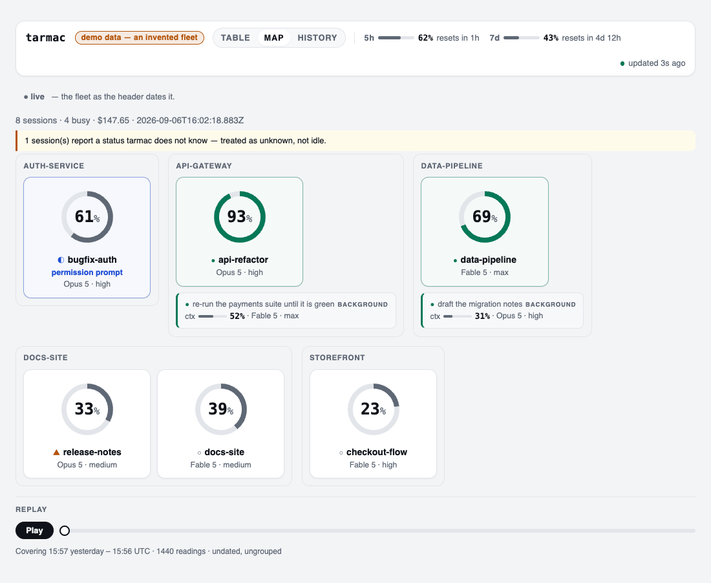
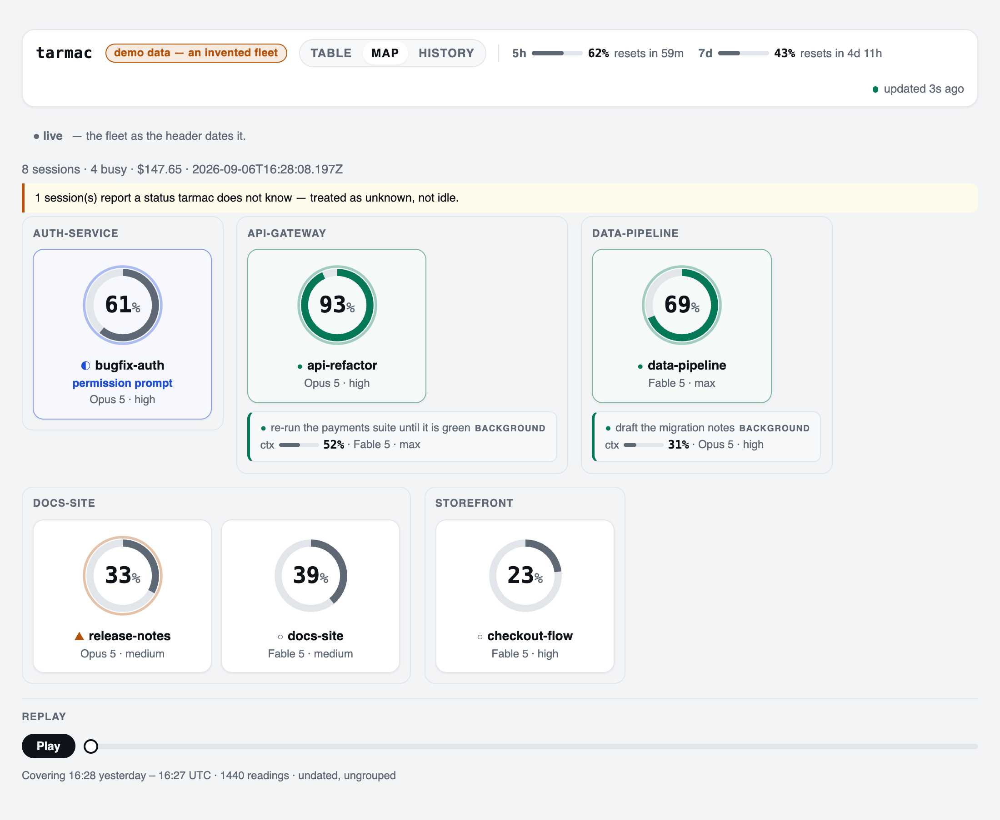

# tarmac

[](https://www.npmjs.com/package/@adrrr/tarmac)
[](https://github.com/adrrr/tarmac/actions/workflows/ci.yml)


**Fleet observability for Claude Code.** One table for every session you have running —
busy or idle, how full its context is, which model, what it has cost so far. It reads
documented surfaces only, never an internal format.

<picture>
  <source media="(prefers-color-scheme: dark)" srcset="docs/media/replay-dark.gif">
  
</picture>

[Quickstart](#quickstart) · [The map](#the-map) · [The dashboard](#the-dashboard) ·
[Install](#install) · [Commands](#commands) · [Configuration](#configuration) ·
[Manual](docs/MANUAL.md) · [Changelog](CHANGELOG.md) · [Issues](https://github.com/adrrr/tarmac/issues)

## Quickstart

```bash
npx @adrrr/tarmac              # one-shot fleet table
npx @adrrr/tarmac --watch      # the same table, redrawn every 5s until ^C
npx @adrrr/tarmac serve        # the same fleet in the browser
npx @adrrr/tarmac install      # chain the status line: unlocks ctx, model, effort and cost
npx @adrrr/tarmac uninstall    # hand your status line back
```

```
$ npx @adrrr/tarmac

PROJECT            STATE  CTX      AS OF  MODEL    EFFORT  COST    UP
apollo             busy   28%      7m     Fable 5  max     $41.20  8h
mercury-dashboard  busy   27%      22m !  Fable 5  max     $62.75  8h
gemini             idle   12%      3h !   Opus 5   high    $5.40   8h
atlas              idle   — fresh  8h !   Opus 5   high    $0.00   8h

! 3 reading(s) marked "!" are older than 10m (--stale-after)

4 sessions · 2 busy · $109.35
```

That is the table with the status line chained. Without it — nothing installed at all — the
same command still lists every session, its state and its uptime, straight from
`claude agents --json`; the context column reads `— absent`, model, effort and cost fall to
`—`, and the line under the table counts how many sessions are covered.

Node ≥ 20. **Zero runtime dependencies** — no framework, no bundler, nothing to audit.

## The map

`tarmac serve` puts the same fleet in the browser — every session a row, ages that keep
climbing, and a banner the moment a refresh fails instead of a table quietly going stale.

<picture>
  <source media="(prefers-color-scheme: dark)" srcset="docs/media/map-dark.png">
  
</picture>

The tab in the header swaps the table for the same fleet as nodes — one per session, the arc
its context, the shape by the name its state, and a single halo when a reading for it landed
moments ago. It is the same reading in the same fragment, so the two views can never disagree.

Four states, and the fleet above is showing all of them: `waiting` leads the sort and says
which answer it is halted on, `busy`, `idle`, and `unknown` — a word `claude agents --json`
printed that tarmac has no boolean for, named above the fleet rather than quietly filed as
`idle`.

The rules the table follows, the map follows: a reading past the freshness threshold is drawn
thin, amber and dated `! 3h ago` rather than as a live one, and a percentage nobody measured
is an empty dotted dial that names which kind of nothing it is — never a ring at zero, and
never a halo, however new the file it came in. A background agent is placed beside the session
sharing its working directory, because the working directory is the only thing the two provably
share; nothing is nested, and no edge is drawn for a relationship the sources do not publish.
Details in [the manual](docs/MANUAL.md#the-map).

Under the map is a **scrubber over the day this serve has seen**. Drag it and the dials render
the fleet as it was at that minute; press play and the day walks past. The record is fetched on
load, never per position, so scrubbing asks the server nothing. A replay never poses as the present: a banner names
the minute and holds the way back, the live fragment is hidden while it is up, halos stay off
because a sample never "just landed", and a session absent from a minute is absent from the
map. The range says what it truly covers — a serve ten minutes old offers ten minutes. The
account's gauges replay too, counted from the minute being shown rather than from now, so the
five-hour window can be watched draining and refilling across a day.

## The dashboard

`serve` prints the settings it resolved, then the URL it got:

```
tarmac serving http://127.0.0.1:4477
```

It binds to loopback and refuses any request whose `Host` is not loopback, or that a browser
does not mark same-origin — your cwd paths and costs never leave the machine. A busy
**default** port walks up to the next free one and says so; a port you chose yourself — flag,
environment or config file — refuses instead, because you chose it.

In the header are the account's **two rate-limit gauges** — the five-hour window and the
seven-day one, each with its used percentage and its reset spelled as the time left. They are
page-level because that is what a rate limit is: one account, which every session below is
spending from. A fleet whose snapshots carry no limits says `— no reading` on a dotted rail
rather than drawing a window at 0%, and a reading past the freshness threshold is dated
`! 40m ago` — the countdown is recomputed every poll, the percentage is as old as its snapshot,
and a page that showed both as now would be lying with the moving one.

## Install

`install` changes the `statusLine` key of `~/.claude/settings.json`, and never on your
say-so alone. It prints the whole plan first — including the exact command that undoes it —
and waits for a **typed word** (`y` is not an answer; scripts pass `--yes`, deliberately):

```
tarmac install — your home

  file             /Users/jane/.claude/settings.json
  statusLine now   ~/bin/my-line.sh
  statusLine next  /Users/jane/.claude/tarmac/statusline.sh
  ↳ which calls    ~/bin/my-line.sh   (your display is unchanged)
  snapshots        /Users/jane/.local/state/tarmac/snapshots
  undo             tarmac uninstall

Type "install" to proceed, anything else to abort:
```

A status line you already had is **wrapped, not replaced**: its display stays byte-identical,
and `uninstall` names which of its four restore modes ran — `bytes`, the usual one, puts the
original file back exactly. Note that the write re-serialises `settings.json`, so a
version-controlled one shows a formatting diff, not a one-line diff.

The only things that land under `~/.claude/` are that wrapper and the `backup.json` that
undoes it, neither of which changes at runtime: the snapshots the wrapper writes at every
frame go to `$XDG_STATE_HOME/tarmac/snapshots` (`~/.local/state/tarmac/snapshots` by
default), because `~/.claude` is a directory people commit. Coming from 0.1.x, `install`
clears the payloads an older version left in there, says how many and from where, and — when
`~/.claude` is a git repository — prints the `.gitignore` line worth adding.

## Why it does not break

The usual ways to watch a Claude Code fleet read something Claude Code never promised would
stay put: transcript files, terminal panes, undocumented paths. Those break on an update,
and — worse — they break *quietly*, reporting a calm empty fleet.

tarmac reads two things instead:

| Source | What it gives | How solid |
|---|---|---|
| `claude agents --json` | which sessions exist, busy, idle or waiting on you, cwd, uptime | a documented CLI surface (`--help`: *"Print active sessions … as a JSON array … for scripting"*) |
| the status line payload | context %, model, effort, cost | the JSON Claude Code hands to your own `statusLine.command` on every frame — **observed, not published as a schema** |

That second line is the honest caveat, and it is the reason the real defence is not
immunity, it is **visible degradation**. A missing measurement is never a confident `0`: it
is an em dash that names which kind of missing it is — `absent` for a session no status line
ever wrote for, `fresh` for one that has taken no turn yet, `drift` for a release that moved
the payload out from under us — and the fleet-wide count sits under the table, as
`! statusline chained on 0/4 sessions`. A stale reading keeps its value and gets **dated**
with a `!`. And when a session shows up on a Claude Code build no fixture covers, tarmac
names that version *before* anything breaks, and keeps reporting. The full state-by-state
table is in [`docs/MANUAL.md`](docs/MANUAL.md).

## Commands

| Command | What it does | Options |
|---|---|---|
| `tarmac list` | one-shot fleet table — the default, so bare `tarmac` runs it | `--home`, `--stale-after`, `--snapshots-dir`, `--claude-bin`, `--json`, `--watch` |
| `tarmac serve` | local dashboard, `GET /` for the table, `GET /map` for the map, `GET /live` for the fragment both refresh from, `GET /api/fleet` for JSON, `GET /api/history` for the last 24h of readings it took while it ran | `--home`, `--port`, `--stale-after`, `--snapshots-dir`, `--claude-bin` |
| `tarmac install` | chain the status line under `<home>/.claude/settings.json`, after confirmation | `--home`, `--yes` |
| `tarmac uninstall` | restore it, and say which of the four restore modes ran | `--home`, `--yes` |

`--help` works everywhere. An option handed to a command that does not read it is an
**error**, not something quietly ignored — and the error names the commands it does belong
to. Both live views tell you **when the last good reading arrived** and **whether the last
refresh failed**: ages keep climbing whether or not the refresh works, failures are banners
with names, and a table is never thrown away for one.

## Configuration

Three numbers are opinions, not truths, so all three are yours; everything else is
deliberately not configurable, and all of it works with no configuration at all.

| Setting | Flag | Environment | `<home>/.claude/tarmac/config.json` | Default |
|---|---|---|---|---|
| freshness threshold | `--stale-after 90s` \| `15m` \| `2h` | `TARMAC_STALE_AFTER` | `"staleAfterMs": 90000` | `10m` |
| port | `--port 8080` | `TARMAC_PORT` | `"port": 8080` | `4477` |
| snapshots dir (read side) | `--snapshots-dir DIR` | `TARMAC_SNAPSHOTS_DIR` | `"snapshotsDir": "DIR"` | the path frozen into the installed wrapper — failing that `$XDG_STATE_HOME/tarmac/snapshots`, when it is absolute *and* the target home is your own, else `<home>/.local/state/tarmac/snapshots` |

**Flag beats environment beats config file beats default**, settled per setting; `serve`
opens by printing each effective value and where it came from. Nothing is silently dropped
or silently corrected — a value that will not parse stops the run and says what it got,
where it came from, and what would have worked, *including* values that were going to lose
the precedence fight anyway.

That last default is read out of the installed wrapper, never recomputed: a reader that
recomputed it would disagree with the writer the moment the two saw different environments
— `XDG_STATE_HOME` exported in your shell, absent from a LaunchAgent or cron — and the
symptom is a healthy, empty fleet, the one failure a fleet monitor may not have. Anything
else reading those payloads can ask where they are: `tarmac list --json` reports the path as
`health.snapshotsDir`. Full rules and edge cases: [`docs/MANUAL.md`](docs/MANUAL.md).

`tarmac list --json` also reports `health.unfilable`: how many live sessions carry an id
tarmac will never file a snapshot under, so a reader can tell telemetry that is *late* from
telemetry that is *not coming*. See [`docs/MANUAL.md`](docs/MANUAL.md) for what makes an id
filable.

## What it deliberately does not do

- **No inferred "waiting for you".** `agents --json` reports `waiting` with a reason —
  a permission prompt, an open dialog — and tarmac draws exactly that, on both surfaces.
  What it will not do is guess at the rest: a session that asked you a question in prose
  still reports `idle`, and the only way to know better is to read a transcript, which is
  the one thing this tool will not do. The signal is as good as the surface, and no better.
- **No history on disk.** `tarmac list` is a snapshot in time. A running `serve` holds the
  last 24 hours of the readings it took itself, in memory, so the page can replay them — a
  record that reaches no further back than the serve that took it, and goes when it goes.
  None of it is written down.
- **No Windows.** The generated wrapper is POSIX `sh`.
- **No remote fleets.** It watches the machine it runs on.

## Development

```bash
npm test                       # typecheck (src + test + scripts), then run the suite
npm run build                  # flat JavaScript into dist/
node scripts/demo-fleet.ts     # the invented fleet the captures above are taken of
```

Every capture on this page is taken of a fleet that does not exist. `demo-fleet` plays an
invented day into a real `serve` — the real collector, the real renderer, both documented
sources standing in as a shell script and a directory of payloads — because a screenshot of a
real machine carries working directories, prompts and costs, and nothing real enters this repo.

CI runs the suite on Node 22 and 24, on Linux and macOS, with `TARMAC_REQUIRE_DASH=1` so a
machine without dash cannot report a green build it did not earn; a separate job builds
`dist/` and runs it on Node 20 — the oldest version `engines` promises, and the only place
the published artefact is ever executed. Releases are cut by hand ([`PUBLISHING.md`](PUBLISHING.md));
capturing fixtures for a new Claude Code build: [`docs/MANUAL.md`](docs/MANUAL.md).

The suite runs the TypeScript sources directly through Node's type stripping, so it needs
Node ≥ 22.18 to *develop*; what ships in `dist/` is plain ES2022 and runs on Node ≥ 20.

## License

MIT
